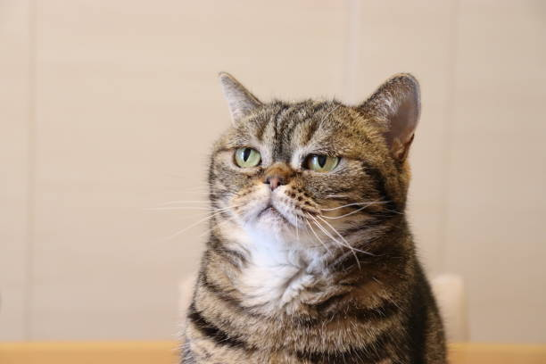

# Cat Image Classification Using Deep Neural Networks

This project uses a deep neural network to classify images as either "cat" or "non-cat." The dataset consists of labeled images, and the model is trained using a multi-layer neural network to achieve high accuracy in classification.

## Project Overview

The goal of this project is to implement a deep neural network (DNN) from scratch to identify whether an image contains a cat. The architecture includes multiple layers with [LINEAR->RELU] activations, followed by a final layer using the sigmoid activation function to make the binary classification (cat or non-cat).

The project is based on the course materials from [Neural Networks and Deep Learning](https://www.coursera.org/learn/neural-networks-deep-learning?specialization=deep-learning) by Deeplearning.AI.

### Key Features:
- **Dataset**: The dataset consists of 209 training examples and 50 test examples, each image being of size (64, 64, 3).
- **Neural Network**: The model is a 5-layer deep neural network, with the following architecture: `[LINEAR -> RELU] x 4 -> LINEAR -> SIGMOID`.
- **Training Process**: The network is trained using forward and backward propagation, and parameters are updated using gradient descent.
- **Accuracy**: The model achieves an accuracy of 98% on the training set and 82% on the test set.
- **Image Prediction**: You can test the model with your own image by uploading an image in `.jpg` format.

## Model Architecture

The model consists of:
1. An input layer with 12,288 nodes (64x64x3 flattened image).
2. Four hidden layers with sizes [20, 7, 5, 3], using the ReLU activation function.
3. An output layer with a single node, using the sigmoid activation function to predict the binary label (1 for "cat," 0 for "non-cat").

## Dependencies

- Python 3.x
- numpy
- matplotlib
- h5py
- scipy
- PIL

## Results

After training the model for 2700 iterations, the following results were obtained:
- **Training Set Accuracy**: 98.1%
- **Test Set Accuracy**: 82%

## Example Predictions

Here is an example prediction:

- Model Prediction: **Cat**

## Acknowledgements

This project was developed as part of the **DeepLearning.AI** course, where I learned the fundamental concepts of deep learning and neural networks. 
